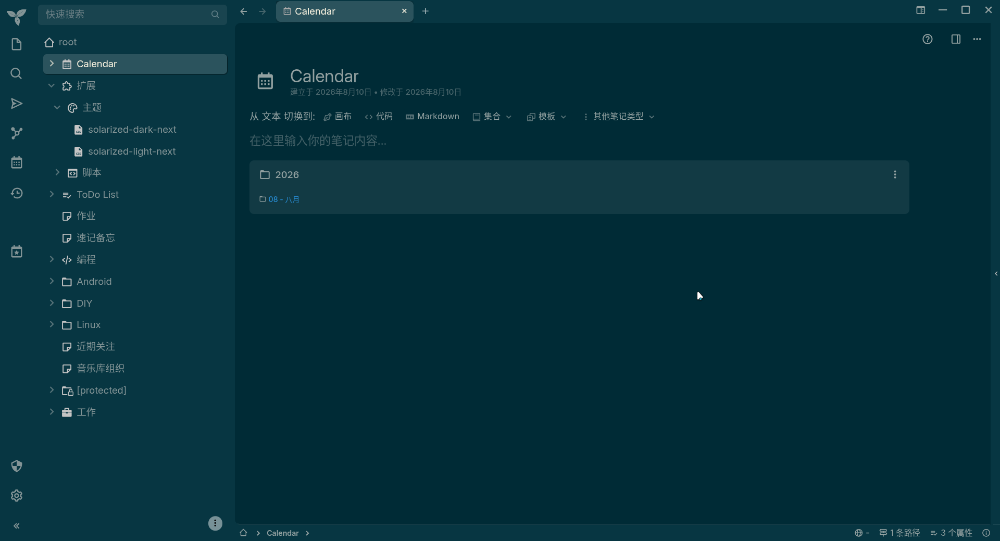
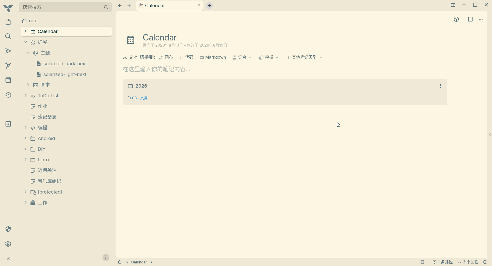

# Trilium Next Solarized Theme
A [Solarized](https://ethanschoonover.com/solarized/) theme for the note-taking app [Trilium Next](https://github.com/TriliumNext/Trilium).

Modified from [WKSu's version](https://github.com/WKSu/trilium-solarized-theme) to make it work with `#appThemeBase=next` in Trilium Next.

## Installation

### Solarized Light
- Create a CSS code note in Trilium and name it `solarized-light`
- Copy the contents of the `solarized-light.css` file into that note.
- Add labels `#appTheme=solarized-light #appThemeBase=next`
- Go to options and select this theme 🥳

### Solarized Dark
- Create a CSS code note in Trilium and name it `solarized-dark`
- Copy the contents of the `solarized-dark.css` file into that note.
- Add labels `#appTheme=solarized-dark #appThemeBase=next`
- Go to options and select this theme 🥳