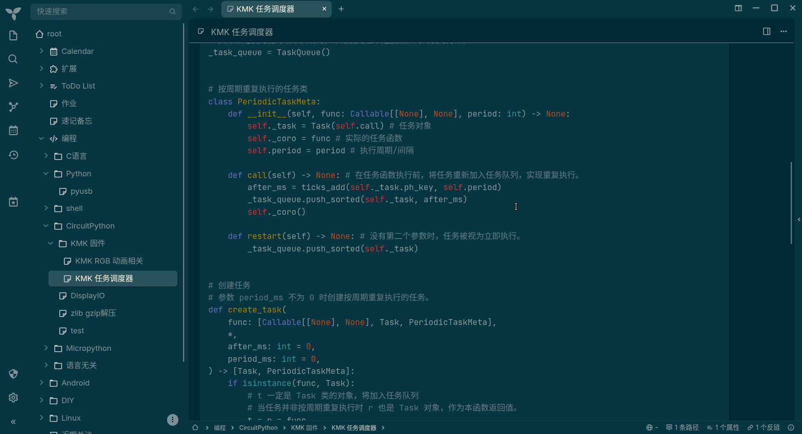
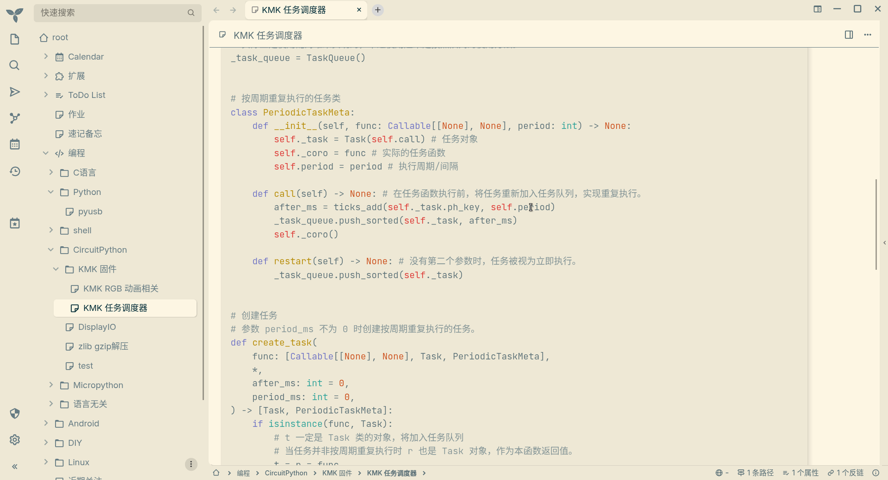

# Trilium Next Solarized Theme
A [Solarized](https://ethanschoonover.com/solarized/) theme for the note-taking app [Trilium Next](https://github.com/TriliumNext/Trilium).

Modified from [WKSu's version](https://github.com/WKSu/trilium-solarized-theme) to make it work with `#appThemeBase=next` in Trilium Next.

This theme also includes a frontend script that makes code blocks use the Solarized color scheme.

Solarized Dark:

Solarized Light:

Code Block Color Scheme (Solarized Dark):

Code Block Color Scheme (Solarized Light):

## Installation

### Solarized Light
- Create a CSS code note in Trilium and name it `solarized-light`
- Copy the contents of the `solarized-light.css` file into that note.
- Add labels `#appTheme=solarized-light #appThemeBase=next`
- Go to options and select this theme 🥳

### Solarized Dark
- Create a CSS code note in Trilium and name it `solarized-dark`
- Copy the contents of the `solarized-dark.css` file into that note.
- Add labels `#appTheme=solarized-dark #appThemeBase=next`
- Go to options and select this theme 🥳

### Code Block Color Scheme (Optional)
- Trilium Next does not include a built-in Solarized color scheme for code blocks, so this theme includes a frontend script to override the built-in color scheme when using `solarized-dark` or `solarized-light` theme.
- Create a JavaScript (Trilium frontend) code note in Trilium and name it `codeblock-highlight-solarized`
- Copy the contents of the `codeblock-highlight-solarized.js` file into that note.
- Add the label `#run=frontendStartup`
- Go to options and select `solarized-dark` or `solarized-light` theme.
- Restart Trilium Next, or press `Ctrl+Shift+R` to reload it.
- Enjoy! 🥳